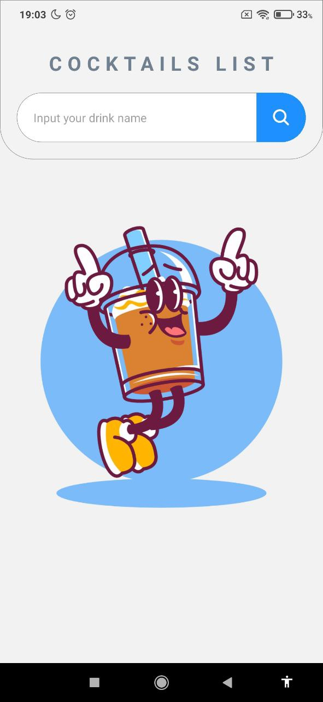
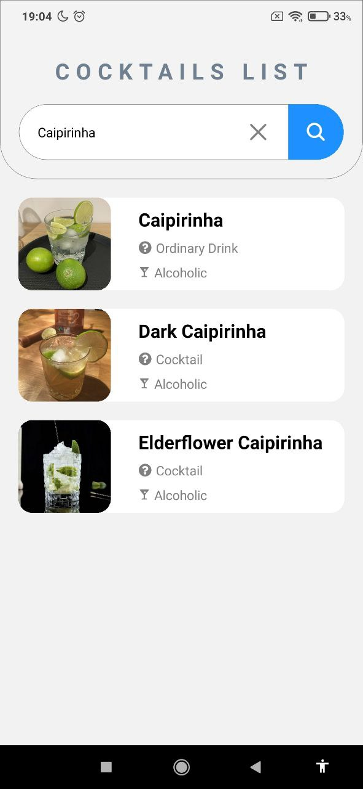
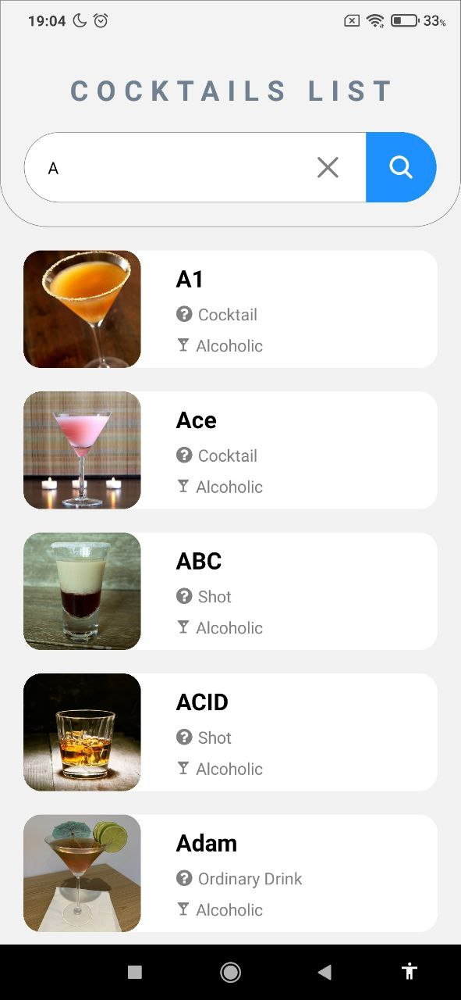
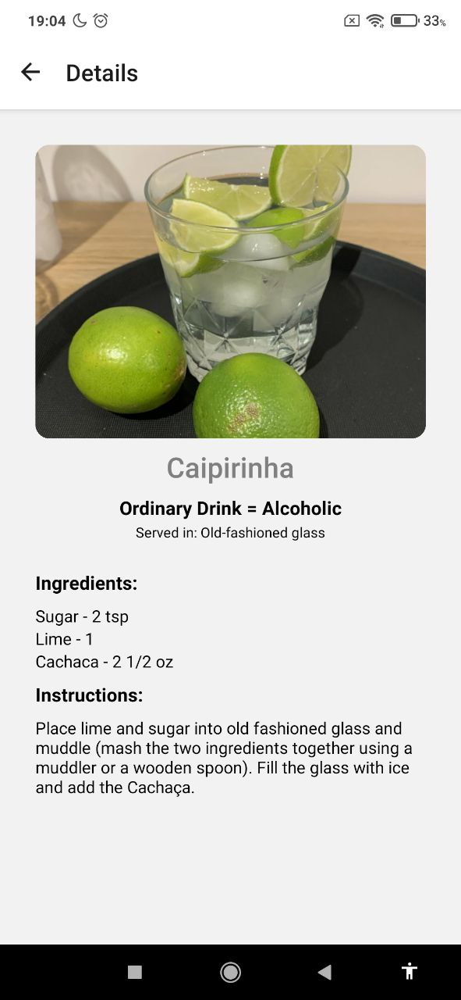

# Drink Native com React Native

O **Drink Native** é um aplicativo desenvolvido em **React Native** com **TypeScript** que utiliza a API [TheCocktailDB](https://www.thecocktaildb.com/) para buscar informações sobre drinks. O projeto foi criado como base para estudos e práticas de desenvolvimento mobile seguindo a aula do [@oprimo.dev](https://www.youtube.com/live/x9Zg90Xo0PY?si=CawTcVP5FZOe58ZN).
---
## Imagens do Projeto
<div style="width: 100%; display: flex; gap: 10px; justify-content: center;">
    
    
    
     
</div>

## Pré-requisitos

Certifique-se de ter as seguintes ferramentas instaladas no seu computador:

- Node.js
- Expo CLI (caso opte por usar o Expo)
- Um emulador de Android ou iOS ou um dispositivo físico configurado
---

## Como instalar e executar o projeto

### 1. Clonando o repositório
Abra o terminal e execute o comando:

```bash
git clone https://github.com/felipealvx/drinks-app-mobile.git
cd drinks-app-mobile
```

### 2. Instalando dependências
Dentor do projeto `./drinks-app-mobile`

```bash
# Usando npm
npm install

# Ou usando yarn
yarn install
```
---
### 3. Executar o projeto

Se você estiver utilizando o Expo, inicie o servidor com o comando:
```bash
npx expo start
```
Depois, escaneie o QR Code no terminal.